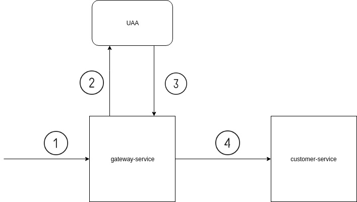

# Spring-cloud-gateway-oauth2-client-credentials

Sample Spring boot app to include uaa client credentials access token with Spring cloud gateway filter

1. Request gateway service without JWT token
2. Request token to UAA server
3. Return access-token
4. Include access-token as Authorization bearer with Spring cloud gateway filter and send the request to customer-service